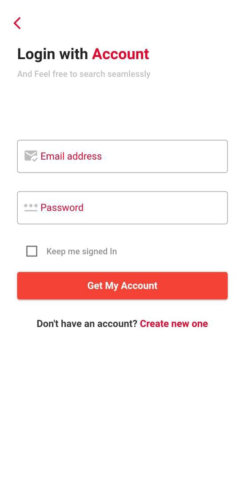
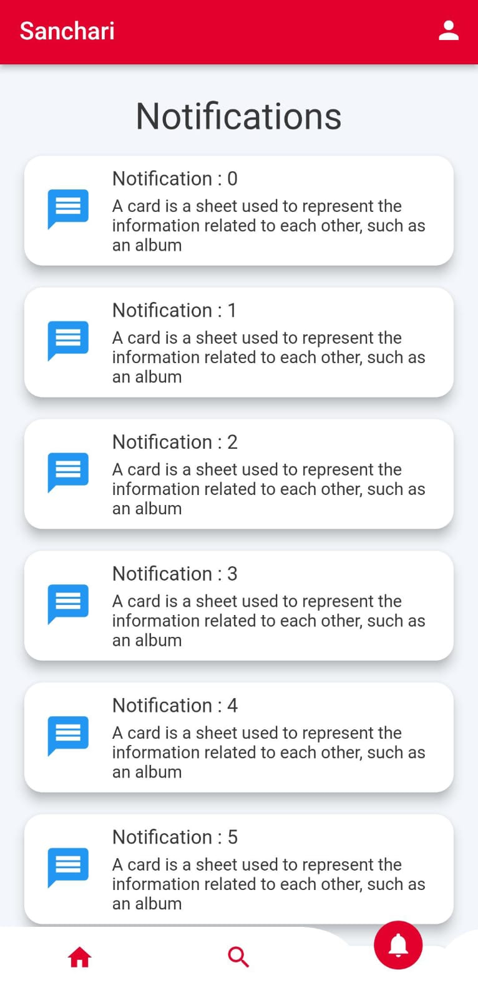

# Sanchari 🚌

[](https://github.com/Sanchari4us/Sanchari/forks)
[](https://github.com/Sanchari4us/Sanchari/issues)
[](https://flutter.dev)
[](https://firebase.google.com)

> A comprehensive Flutter mobile application for bus transportation services with real-time tracking, route management, and user-friendly features.

## 📋 Table of Contents

- [Overview](#overview)
- [Features](#features)
- [Screenshots](#screenshots)
- [Technology Stack](#technology-stack)
- [Architecture](#architecture)
- [Prerequisites](#prerequisites)
- [Installation](#installation)
- [Configuration](#configuration)
- [Usage](#usage)
- [Project Structure](#project-structure)
- [Development](#development)
- [Contributing](#contributing)
- [Troubleshooting](#troubleshooting)
- [License](#license)
- [Acknowledgments](#acknowledgments)

## 🎯 Overview

Sanchari is a modern Flutter mobile application designed to enhance public transportation experience. Built with a focus on user convenience and real-time information, the app provides comprehensive bus service management including route tracking, stop locations, notifications, and user account management.

The application features a clean, intuitive interface with both light and dark theme support, making it accessible and user-friendly for all demographics. With Firebase integration for backend services and Google Maps for location-based features, Sanchari offers a complete transportation solution.

### Key Highlights
- **Real-time Bus Tracking**: Live location updates and route information
- **Interactive Maps**: Google Maps integration for route visualization
- **User Authentication**: Secure login system with Firebase Auth
- **Smart Notifications**: Real-time updates on bus schedules and delays
- **Bookmarks System**: Save favorite routes and stops
- **Dark/Light Themes**: Adaptive UI with theme switching
- **Cross-platform**: Works on both Android and iOS devices

## ✨ Features

### Core Features
- 🚌 **Bus Route Management** - Comprehensive bus route information and schedules
- 📍 **Real-time Tracking** - Live GPS tracking of bus locations
- 🗺️ **Interactive Maps** - Google Maps integration with route visualization
- 🔍 **Smart Search** - Find routes, stops, and services easily
- 📱 **Push Notifications** - Real-time alerts and service updates
- 🔖 **Bookmarks** - Save frequently used routes and stops

### User Management
- 🔐 **Firebase Authentication** - Secure user registration and login
- 👤 **User Profiles** - Personalized user accounts and preferences
- ✏️ **Profile Editing** - Update personal information and settings
- 📞 **Contact Support** - Direct communication with support team
- 💬 **Feedback System** - Submit feedback and suggestions

### Technical Features
- 🌙 **Theme Switching** - Light and dark mode support with smooth transitions
- 📊 **State Management** - Provider pattern for efficient state handling
- 🔄 **Offline Support** - Cached data for offline functionality
- 📲 **QR Code Integration** - QR code scanning for quick access
- 🌐 **Multi-platform** - Android, iOS, and web support
- 🎨 **Custom UI** - Beautiful curved navigation and smooth animations

### Admin Features
- 👨‍💼 **Admin Dashboard** - Administrative control panel
- 📈 **Analytics** - Usage statistics and performance metrics
- 🔧 **Service Management** - Manage routes, schedules, and notifications
- 👥 **User Management** - Handle user accounts and permissions

## 📸 Screenshots

<div align="center">
  
### Welcome & HomePage
 

### Search & Bus Tracking  
 

### Maps & Route Tracking
 

### Authentication & Feedback
 

### User Profile (Light & Dark)
 

### Admin & Team
 

### Notifications


</div>

### Adding Screenshots
To add screenshots to your fork:
1. Create a `screenshots/` folder in your repository root
2. Take screenshots of key app features:
   - `app-demo.png` - Main app interface
   - `login.png` - Authentication screens
   - `maps.png` - Google Maps integration
   - `dashboard.png` - User dashboard
   - `notifications.png` - Notifications interface
   - `bookmarks.png` - Bookmarks feature
   - `profile.png` - User profile management
3. Save as PNG files and commit to repository

## 🛠️ Technology Stack

### Frontend Framework
- **Flutter**: 3.0+ - Google's UI toolkit for cross-platform development
- **Dart**: 2.16.2+ - Programming language optimized for UI development

### Backend & Services
- **Firebase Core**: 1.17.1 - Firebase services integration
- **Firebase Auth**: 3.3.19 - User authentication and management
- **Cloud Firestore**: 3.1.17 - NoSQL cloud database
- **Google Sign-In**: 4.4.4 - Social authentication

### Maps & Location
- **Google Maps Flutter**: 2.1.4 - Interactive maps integration
- **Google Place**: 0.4.7 - Places API for location services
- **Location**: 4.4.0 - GPS location services
- **GeoFlutter Fire**: 3.0.3 - Geolocation with Firebase
- **Maps Launcher**: 2.0.1 - External maps app integration
- **Flutter Polyline Points**: 1.0.0 - Route polyline rendering

### UI/UX Libraries
- **Curved Navigation Bar**: 1.0.3 - Beautiful bottom navigation
- **Animated Theme Switcher**: 2.0.6 - Smooth theme transitions
- **Google Fonts**: 2.0.0 - Custom font integration
- **Flutter ScreenUtil**: 5.5.3+2 - Responsive screen adaptation
- **Touch Ripple Effect**: 2.2.3 - Interactive touch effects
- **Line Awesome Flutter**: 2.0.0 - Icon library

### Utilities
- **Provider**: 6.0.3 - State management solution
- **Animated Splash Screen**: 1.2.0 - App launch animation
- **Share**: 2.0.4 - Content sharing functionality
- **Scan**: 1.6.0 - QR code scanning
- **Fluttertoast**: 8.0.9 - Toast notifications
- **Flutter Typeahead**: 4.0.0 - Search autocomplete
- **Snippet Coder Utils**: 1.0.12 - Utility functions

## 🏗️ Architecture

```
┌─────────────────────────────────────────────────────────────────────────────┐
│                           Sanchari App Architecture                         │
├─────────────────────────────────────────────────────────────────────────────┤
│                                                                             │
│  ┌──────────────────┐    ┌──────────────────┐    ┌──────────────────┐      │
│  │   Flutter UI     │    │   State Mgmt     │    │   Firebase       │      │
│  │                  │◄──►│                  │◄──►│                  │      │
│  │ - Screens/Pages  │    │ - Provider       │    │ - Authentication │      │
│  │ - Widgets        │    │ - Models         │    │ - Firestore DB   │      │
│  │ - Navigation     │    │ - Notifiers      │    │ - Cloud Storage  │      │
│  │ - Themes         │    │                  │    │                  │      │
│  └──────────────────┘    └──────────────────┘    └──────────────────┘      │
│           │                        │                        │               │
│           │                        │                        │               │
│           ▼                        ▼                        ▼               │
│  ┌──────────────────┐    ┌──────────────────┐    ┌──────────────────┐      │
│  │   Google Maps    │    │   Local Storage  │    │   External APIs  │      │
│  │                  │    │                  │    │                  │      │
│  │ - Route Display  │    │ - Preferences    │    │ - Places API     │      │
│  │ - Live Tracking  │    │ - Cache Data     │    │ - Directions API │      │
│  │ - Polylines      │    │ - User Data      │    │ - Geolocation    │      │
│  │ - Markers        │    │                  │    │                  │      │
│  └──────────────────┘    └──────────────────┘    └──────────────────┘      │
└─────────────────────────────────────────────────────────────────────────────┘
```

### Architecture Principles
- **MVVM Pattern**: Model-View-ViewModel architecture for clean separation
- **Provider State Management**: Centralized state management across the app
- **Firebase Backend**: Cloud-based backend services for scalability
- **Responsive Design**: Adaptive UI for different screen sizes and devices

## 📋 Prerequisites

### Development Environment
- **Flutter SDK**: 3.0 or higher
- **Dart SDK**: 2.16.2 or higher
- **Android Studio**: Latest version with Flutter plugin
- **VS Code**: With Flutter and Dart extensions (alternative)

### Platform Requirements
- **Android**: API level 21 (Android 5.0) or higher
- **iOS**: iOS 11.0 or higher
- **Web**: Modern web browsers (Chrome, Firefox, Safari, Edge)
- **Windows**: Windows 10 version 1903 or higher

### Required Tools
- **Git**: For version control
- **Android SDK**: For Android development
- **Xcode**: For iOS development (macOS only)
- **Google Cloud Console**: For Maps API and Firebase setup

## 🚀 Installation

### 1. Clone the Repository
```bash
git clone https://github.com/Sanchari4us/Sanchari.git
cd Sanchari
```

### 2. Install Dependencies
```bash
# Get Flutter packages
flutter pub get

# For iOS (if developing on macOS)
cd ios && pod install && cd ..
```

### 3. Flutter Doctor Check
```bash
flutter doctor
```
Resolve any issues shown by Flutter Doctor before proceeding.

### 4. Run the Application

#### Development Mode
```bash
# Run on connected device/emulator
flutter run

# Run on specific device
flutter devices  # List available devices
flutter run -d <device-id>

# Run with hot reload
flutter run --hot
```

#### Build for Production
```bash
# Android APK
flutter build apk --release

# Android App Bundle (recommended for Play Store)
flutter build appbundle --release

# iOS (requires macOS and Xcode)
flutter build ios --release
```

## ⚙️ Configuration

### Firebase Setup

1. **Create Firebase Project**:
   - Go to [Firebase Console](https://console.firebase.google.com/)
   - Create a new project
   - Add Android/iOS apps to the project

2. **Download Configuration Files**:
   - **Android**: Download `google-services.json` → place in `android/app/`
   - **iOS**: Download `GoogleService-Info.plist` → place in `ios/Runner/`

3. **Enable Firebase Services**:
   - Authentication (Email/Password, Google Sign-In)
   - Cloud Firestore
   - Firebase Storage (if using file uploads)

### Google Maps API Setup

1. **Get API Keys**:
   - Go to [Google Cloud Console](https://console.cloud.google.com/)
   - Enable Maps SDK for Android/iOS
   - Enable Places API and Directions API
   - Create API credentials

2. **Add API Keys**:

#### Android (`android/app/src/main/AndroidManifest.xml`)
```xml
<application>
    <meta-data
        android:name="com.google.android.geo.API_KEY"
        android:value="YOUR_ANDROID_API_KEY"/>
</application>
```

#### iOS (`ios/Runner/AppDelegate.swift`)
```swift
import GoogleMaps

@main
@objc class AppDelegate: FlutterAppDelegate {
  override func application(
    _ application: UIApplication,
    didFinishLaunchingWithOptions launchOptions: [UIApplication.LaunchOptionsKey: Any]?
  ) -> Bool {
    GMSServices.provideAPIKey("YOUR_IOS_API_KEY")
    GeneratedPluginRegistrant.register(with: self)
    return super.application(application, didFinishLaunchingWithOptions: launchOptions)
  }
}
```

### Environment Variables
Create a `.env` file in the project root:
```env
# Google Maps API
GOOGLE_MAPS_API_KEY_ANDROID=your-android-api-key
GOOGLE_MAPS_API_KEY_IOS=your-ios-api-key

# Firebase Configuration (if using environment-based config)
FIREBASE_API_KEY=your-firebase-api-key
FIREBASE_PROJECT_ID=your-project-id
FIREBASE_MESSAGING_SENDER_ID=your-sender-id
FIREBASE_APP_ID=your-app-id
```

## 🎯 Usage

### Running the App

1. **Start the Application**:
   ```bash
   flutter run
   ```

2. **User Registration/Login**:
   - Open the app and navigate to authentication
   - Register with email/password or Google Sign-In
   - Complete profile setup

3. **Core Features**:
   - **Home**: View available bus routes and services
   - **Search**: Find specific routes, stops, or services
   - **Bookmarks**: Save frequently used routes
   - **Notifications**: Receive real-time service updates
   - **Profile**: Manage account settings and preferences

### Development Commands

```bash
# Hot reload (during development)
r  # Hot reload
R  # Hot restart
h  # List available commands
q  # Quit

# Code generation (if using build_runner)
flutter packages pub run build_runner build

# Analyze code quality
flutter analyze

# Run tests
flutter test

# Format code
dart format lib/
```

## 📁 Project Structure

```
sanchari/
├── android/                    # Android-specific configuration
├── ios/                        # iOS-specific configuration
├── web/                        # Web-specific configuration
├── windows/                    # Windows-specific configuration
├── assets/                     # App assets (images, fonts, etc.)
│   ├── auth/                  # Authentication-related assets
│   ├── admin/                 # Admin panel assets
│   └── team/                  # Team/about assets
├── fonts/                      # Custom fonts (OpenSans family)
├── lib/                        # Main source code
│   ├── Models/                # Data models and entities
│   ├── Providers/             # State management providers
│   │   ├── darkTheme_provider.dart
│   │   └── qrCodeProvider.dart
│   ├── UI/                    # User interface screens
│   │   ├── Admin/             # Admin panel screens
│   │   ├── Auth/              # Authentication screens
│   │   ├── GoogleMap/         # Map-related screens
│   │   ├── Home/              # Main app screens
│   │   │   ├── home.dart
│   │   │   ├── search.dart
│   │   │   ├── bookMark.dart
│   │   │   └── notifications.dart
│   │   ├── busDetails.dart
│   │   ├── contactUs.dart
│   │   ├── profile.dart
│   │   └── feedback.dart
│   ├── constants.dart         # App constants and themes
│   ├── firebase_options.dart  # Firebase configuration
│   └── main.dart             # App entry point
├── pubspec.yaml              # Dependencies and project config
└── README.md                 # This file
```

## 🛠️ Development

### Code Style and Standards

#### Dart Code Formatting
```bash
# Format all Dart files
dart format lib/

# Analyze code for issues
flutter analyze

# Check for unused dependencies
flutter pub deps
```

#### Recommended VS Code Extensions
- Flutter
- Dart
- Flutter Intl
- Firebase Explorer
- GitLens

### State Management

The app uses the **Provider** pattern for state management:

```dart
// Example provider usage
class DarkTheme extends ChangeNotifier {
  bool isLightMode = true;

  void toggleTheme() {
    isLightMode = !isLightMode;
    notifyListeners();
  }
}

// Usage in widgets
Consumer<DarkTheme>(
  builder: (context, theme, child) {
    return Container(
      color: theme.isLightMode ? Colors.white : Colors.black,
    );
  },
)
```

### Testing

```bash
# Run all tests
flutter test

# Run specific test file
flutter test test/models/user_model_test.dart

# Run tests with coverage
flutter test --coverage
```

### Building for Release

#### Android
```bash
# Generate signed APK
flutter build apk --release

# Generate App Bundle (recommended for Play Store)
flutter build appbundle --release
```

#### iOS
```bash
# Build for iOS (requires macOS and Xcode)
flutter build ios --release
```

## 🤝 Contributing

We welcome contributions from the community! Here's how you can help:

### Getting Started
1. Fork the repository
2. Create a feature branch: `git checkout -b feature/amazing-feature`
3. Make your changes
4. Follow the coding standards
5. Test your changes thoroughly
6. Commit with descriptive messages: `git commit -m "Add amazing feature"`
7. Push to your branch: `git push origin feature/amazing-feature`
8. Submit a pull request

### Development Guidelines
- Follow Dart and Flutter best practices
- Use meaningful variable and function names
- Add comments for complex logic
- Ensure responsive design across devices
- Test on both Android and iOS platforms
- Update documentation for new features

### Code Review Process
- All pull requests require review by maintainers
- Automated tests must pass
- Code should be formatted and analyzed
- New features should include tests
- Documentation should be updated

## 🐛 Troubleshooting

### Common Issues

#### Flutter Installation Issues
**Issue**: `Flutter command not found`
```bash
# Solution: Add Flutter to PATH
export PATH="$PATH:`pwd`/flutter/bin"
# Add to ~/.bashrc or ~/.zshrc for persistence
```

**Issue**: `Doctor issues with Android toolchain`
```bash
# Solution: Accept Android licenses
flutter doctor --android-licenses
```

#### Firebase Setup Issues
**Issue**: `FirebaseOptions have not been configured`
```bash
# Solution: Ensure firebase_options.dart is properly generated
# Run firebase init or manually add Firebase configuration
```

**Issue**: `Google Services plugin issues`
```bash
# Solution: Check google-services.json placement
# Should be in android/app/google-services.json
```

#### Maps Integration Issues
**Issue**: `Map not loading or showing gray screen`
```bash
# Solution: Verify API key is correct and has proper permissions
# Check if Maps SDK is enabled in Google Cloud Console
# Ensure billing is enabled for the project
```

**Issue**: `Location permission denied`
```bash
# Solution: Add permissions to AndroidManifest.xml and Info.plist
# Handle runtime permissions in the app
```

#### Build Issues
**Issue**: `Build failed with minSdkVersion error`
```bash
# Solution: Update android/app/build.gradle
android {
    defaultConfig {
        minSdkVersion 21  // or higher
    }
}
```

**Issue**: `Pod install fails on iOS`
```bash
# Solution: Clean and reinstall pods
cd ios
rm -rf Pods Podfile.lock
pod install
```

### Performance Optimization

- **Use `const` constructors** for widgets that don't change
- **Implement proper `dispose()`** methods for controllers
- **Use `ListView.builder()`** for large lists
- **Optimize images** and use appropriate formats
- **Cache network requests** when possible
- **Use `flutter analyze`** to identify performance issues

### Getting Help
- 📖 **Documentation**: Check Flutter and Firebase official docs
- 🐛 **Issues**: Search existing [GitHub issues](https://github.com/Sanchari4us/Sanchari/issues)
- 💬 **Community**: Join Flutter community forums
- 📧 **Support**: Contact the development team

## 📄 License

This project is licensed under the MIT License - see the [LICENSE](LICENSE) file for details.

### License Summary
- ✅ Commercial use
- ✅ Modification
- ✅ Distribution
- ✅ Private use
- ❌ Liability
- ❌ Warranty

## 🙏 Acknowledgments

### Development Team
- **[@Sanchari4us](https://github.com/Sanchari4us)** - Project Repository Account
- **[@jeethendra2000](https://github.com/jeethendra2000)** - Core Developer [ UI/UX,Features and Maps integration]
- **[@pranav-bharadwaj](https://github.com/pranav-bharadwaj)** - Core Developer [Login & Signup using Firebase Authentication]
- **[@bamonika9](https://github.com/bamonika9)** - Project team member

- **[@nischitha](https://github.com/nischitha)** - Project Team Member


### Special Thanks
- **Annaiah Sir GECH** - For Monitoring Project Team
- **Google Flutter Team** - For the amazing cross-platform framework
- **Firebase Team** - For comprehensive backend services
- **Google Maps Platform** - For location and mapping services
- **Open Source Community** - For the incredible packages and tools

### Built With
- [Flutter](https://flutter.dev/) - Google's UI toolkit for cross-platform development
- [Firebase](https://firebase.google.com/) - Backend-as-a-Service platform
- [Google Maps](https://developers.google.com/maps) - Maps and location services
- [Provider](https://pub.dev/packages/provider) - State management solution
- [Material Design](https://material.io/) - Design system and components

### Assets & Resources
- **OpenSans Font Family** - Modern and readable typography
- **Material Icons** - Consistent iconography
- **Custom Assets** - Original graphics and branding elements

---

<div align="center">
  <strong>🚌 Built with ❤️ using Flutter & Firebase</strong>
</div>

<div align="center">
  <sub>Making public transportation accessible and user-friendly for everyone!</sub>
</div>

<div align="center">
  
[](https://flutter.dev/)
[](https://firebase.google.com/)

</div>